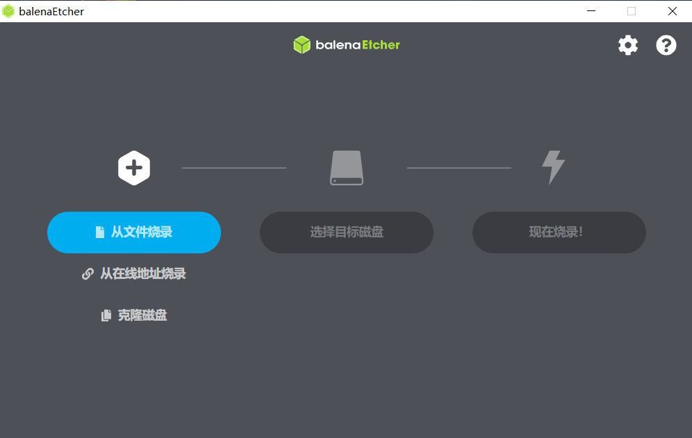
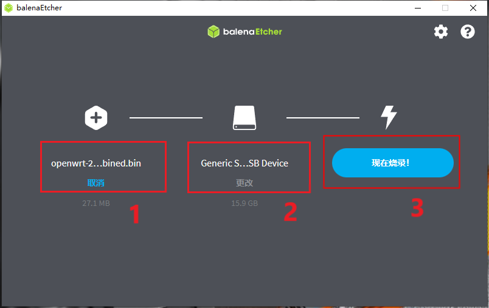

# 烧录镜像到 SD卡

## 1、镜像下载

访问下载地址，下载 imx6ull 阿尔法开发板相应 OpenWrt [系统的镜像](https://github.com/boxwoodt/imx6ull_openwrt/releases/download/v1.0/openwrt-23.05-snapshot-r0+23781-0844937947-imx-cortexa7-imx6ull-atk-emmc-squashfs-combined.bin)。

也可以通过 [imx6ull_openwrt 库](https://github.com/boxwoodt/imx6ull_openwrt)中的 [Releases](https://github.com/boxwoodt/imx6ull_openwrt/releases)区域下载。

## 2、准备工作

- Micro SD卡一张(以下简称 SD卡)，推荐使用大品牌 **Class 10** 及以上等级的 SD卡，容量 4GB 及以上。

- 读卡器一个，用于在电脑上读写 SD卡。

- 电脑环境，Windows和Ubuntu系统均可。

- 烧录软件：[Etcher镜像烧录软件](https://etcher.balena.io/#download-etcher).

## 3、Etcher的安装

下载完成后，直接安装软件即可。安装完成后，界面如下：

## 4、SD卡 烧写镜像

- 打开 balenaEtcher 烧录软件。

- 点击 **从文件烧录** ，选择要烧录的镜像包。

- 点击 **选择目标磁盘** ，选择要烧录的SD卡。

- 点击 **现在烧录** ，完成烧录。

## 5、系统运行

- 将 SD卡 插上开发板。

- 拨码开关调整为 SD卡 启动。

- 上电后，系统自动运行，可以通过串口观察系统启动流程。

