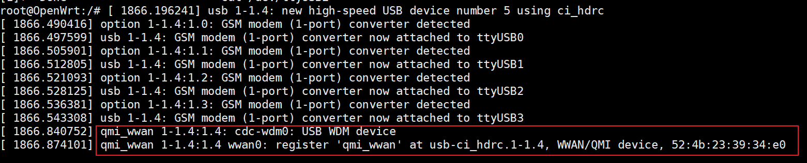
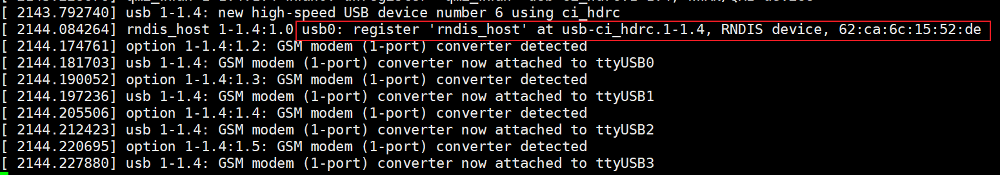

# OpenWRT 使用 EC20 无线网卡模块上网

由于无线上网卡驱动的完善，随着内核的更新大部分的 4G/5G 无线网卡得到免驱支持。

OpenWRT 社区包含了大量的无线网卡驱动，其中不乏 4G/5G 模块，现如今市面上常见的模块型号都得到了支持。

## 1、模块介绍

移远EC20支持4种模式。
- 0:rmnet模式  

    通过 QMI 工具发的 QMI 命令，获取公网 IP。这种模式可以配合 usb_ecm 驱动或高通 GobiNet 驱动使用。

- 1:ecm模式

    通过标准的 CDC-ECM 发起 data call，是发送标准的 ECM 命令，获取局域网 ip。这种模式配合 cdc_ether 驱动使用。

- 2:mbim模式

    Mobile Broadband Interface Model,正宗的移动宽带接口模型，专门用于 3G/4G/5G 模块的，只在 win8 以上的 windows 上使用。一般只在 WINDOWS 下使用。

- 3:rndis模式

    基于 USB 实现 RNDIS 实际上就是 TCP/IP over USB，就是在 USB 设备上跑 TCP/IP，让 USB 设备看上去像一块网卡获取局域网 ip。这种方式最简单，模块插上手机卡之后，模块会自动拨号上网。


模块是使用 AT 指令操作的。所以可以使用 minicom 来进行操作，这里为了简化操作，没使用 minicom，而是直接在命令行上操作。

```shell
#查询当前模式

#在后台显示 /dev/ttyUSB2 返回的信息(如果想退出后台显示,使用后面的命令：kill)
cat /dev/ttyUSB2 &

#查询当前网卡的模式
echo -e "AT+QCFG=\"usbnet\"\r\n" >  /dev/ttyUSB2

#例子:
root@npi:~# cat /dev/ttyUSB2 &
root@npi:~# echo -e "AT+QCFG=\"usbnet\"\r\n" >  /dev/ttyUSB2
root@npi:~#
+QCFG: "usbnet",3

OK

#解析
可以看到返回了3，这个是网卡在RNDIS模式
```

## 2、配置网卡模式

- 切换为 RMNET 模式

```shell
echo -e "AT+QCFG=\"usbnet\",0\r\n" > /dev/ttyUSB2    #设定模式
echo -e "AT+CFUN=1,1\r\n" > /dev/ttyUSB2             #重启模块
```



- 切换为 RNDIS 模式

```shell
echo -e "AT+QCFG=\"usbnet\",3\r\n" > /dev/ttyUSB2    #设定模式
echo -e "AT+CFUN=1,1\r\n" > /dev/ttyUSB2             #重启模块
```



## 3、设备连接

后续章节以 RNDIS 为例。插入SIM卡，装上 4G上网模块，开发板运行正常后，使用信息查询命令 lsusb（需要安装usbutils）和 dmesg 。

```shell
root@OpenWrt:/etc/config# lsusb
Bus 001 Device 004: ID 2c7c:0125 Android Android
Bus 001 Device 003: ID 0bda:8179 Realtek 802.11n NIC
Bus 001 Device 002: ID 1a40:0101  USB2.0 HUB
Bus 001 Device 001: ID 1d6b:0002 Linux 5.15.148 ehci_hcd EHCI Host Controller
```

```shell
root@OpenWrt:/etc/config# dmesg
...
[   23.258428] usbcore: registered new interface driver option
[   23.264235] usbserial: USB Serial support registered for GSM modem (1-port)
[   23.272181] option 1-1.4:1.2: GSM modem (1-port) converter detected
[   23.279216] usb 1-1.4: GSM modem (1-port) converter now attached to ttyUSB0
[   23.286844] option 1-1.4:1.3: GSM modem (1-port) converter detected
[   23.293791] usb 1-1.4: GSM modem (1-port) converter now attached to ttyUSB1
[   23.301417] option 1-1.4:1.4: GSM modem (1-port) converter detected
[   23.308417] usb 1-1.4: GSM modem (1-port) converter now attached to ttyUSB2
[   23.316054] option 1-1.4:1.5: GSM modem (1-port) converter detected
[   23.322976] usb 1-1.4: GSM modem (1-port) converter now attached to ttyUSB3
```

在 `lsusb` 命令中看到一个名为Android设备。在 `dmesg` 信息中可以看到 `GSM` 等信息。同时可以用 `ifconfig -a` 查询设备自动创建的网卡 `usb0`。

## 4、创建网络接口

由于 OpenWRT 默认没有对网卡启用 DHCP Client ，因此不会看到被分配的 IP 信息。这种情况下我们只需要在 WEB 管理界面的 **网络** --- **添加新接口** ，输入一个 wan口 名称，并选择协议为 DHCP 客户端 ，选中对应的 usb0 网卡 。


新建后修改网卡防火墙，选择 wan 保存。之后就可以看到接口界面该网卡获得了IP地址，客户端即可正常上网。


# 5、上网驱动

我的 Openwrt 内核版本是 5.15.148，OpenWrt 版本 23.05。对于高版本的内核与系统，基于 Rndis 协议的 4G 模块是免驱的，但如果是低版的 OpenWrt 有概率会阉割相关的USB功能，需要配置以下内核模块。

`make menuconfig` 进入图形界面配置

1. 内核模块配置

```
    Kernel modules >>
        USB Support >>
            <*> Kmod -usb-core
            -*-Kmod -usb-net
            -*- kmod-usb-net-cdc-ether//【可选】
            <*> kmod-usb-net-cdc-mbim
            -*- kmod-usb-net-cdc-ncm
            <*> kmod-usb-net-cdc-subset//【可选】
            <*>kmod-usb-net-qmi-wwan
            <*>Kmod-usb-ohci     //这个选项一定要勾选，否则可能无法在系统中查看设备
            <*>Kmod-usb-serial
            <*>Kmod-usb-serial-option
            <*>Kmod-usb-serial-wwan
            <*>kmod-usb-uhci
            <*>Kmod-usb2
```

2. 网络模块配置

```
    NetWork   >>
        <*>WWAN    
            -*- comgt
            <*> comgt-ncm
            -*- uqmi    //支持qmi接口
        <*>chat    //建立串行通行需要
        <*>ppp     //支持标准的点对点协议(point-to-point protocol)
        <*>pppstats
        <*>umbim   //一些加密狗用mbim协议
        <*>wwan    
```

3. 其他配置

```
    Utilities
      <*>usb-modeswitch //自动模式更改，将设备置于USB调制解调器模式 @该处勾选之后编译报错、原因未知@
      <*>usbutils       //【可选，可查看usb设备】
```

4. Luci界面配置

```
    Luci
    1. Collections
      <*> luci
    3. Applications
      <*> luci-app-mwan3 (luci support for the MWAN3 multiwan hotplug script) //多播配置，负载均衡
      <*> luci-app-qos  //可选，以提供QOS支持
    6. Protocols
      <*> luci-proto-3g
      -*- luci-proto-ppp
      <*> luci-proto-qmi
```

## 6、配置默认4G接口

修改文件 `package/base-files/files/bin/config_generate` 。

增加 4G 接口，同时在生成 network 配置文件中，添加 `generate_4g_network` 。

```bash
generate_4g_network() {
	uci -q batch <<-EOF
		delete network.wan_4g
		set network.wan_4g='interface'
		set network.wan_4g.proto='dhcp'
		set network.wan_4g.device='usb0'
	EOF
}

if [ ! -s /etc/config/network ]; then
	touch /etc/config/network
	generate_static_network

	json_get_keys keys network
	for key in $keys; do generate_network $key; done

	json_get_keys keys switch
	for key in $keys; do generate_switch $key; done

	generate_4g_network
fi
```

修改 4G 接口防火墙配置。本次 OpenWRT 使用 23.05 版本，使用 firewall4 管理防火墙。
- 其管理位置在 `package/network/config/firewall4` 。
- 下载后的源码位置在 `build_dir/target-arm_cortex-a7+neon-vfpv4_musl_eabi/firewall4-2023-09-01-598d9fbb` 。
- 修改默认防火墙位置在 `build_dir/target-arm_cortex-a7+neon-vfpv4_musl_eabi/firewall4-2023-09-01-598d9fbb/root/etc/config/firewall` 。

```bash
config zone
	option name		wan
	list   network		'wan'
	list   network		'wan6'
	option input		  ACCEPT
	option output		  ACCEPT
	option forward		REJECT
	option masq		    1
	option mtu_fix		1
	list   network    'wan_4g'  // 将 wan_4g 接口放在 wan 区域
```